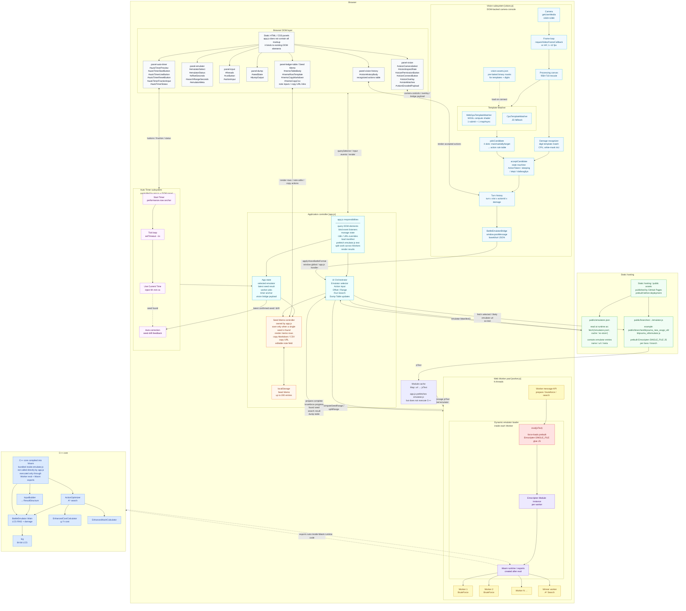

## DQIX Solo Travel Battle Emulator


- Highly optimized, algorithmic combinatorial optimization
- Written in C++
- 100% open source
- MIT License
- Individual management with git branches
- For RTA Players

## Disclaimer

This project does not distribute or include any copyrighted game data.<br>
Our battle emulator is designed to avoid including any copyrighted data.<br>
The terms and conditions for avoiding conflicts on the Battle Emulator can
be [viewed here](https://www.dropbox.com/scl/fi/ljf4ij06fux9s2527dnyp/DQ9_BattleEmu_Readme.txt?rlkey=o5xmzegriye8krmni3ma7zg82&st=1x0aowuh&dl=0) (
Japanese)

## What is our goal?

Our goal is to create a fully debugged battle emulator with many story bosses, and we will continue to move forward with
this goal.  
Our team dedicates significant time to debugging to ensure the battle emulator perfectly matches actual gameplay on the
hardware.

## RTA chart and input method for argument parser

https://note.com/zeppeki0711/n/neac461916cc8

# Quick Start

## Try Online!

Run the battle emulator on your CPU in your browser!<br>

|               emu               |      Bosses      |                                   url                                    |                                                                 example                                                                  |
|:-------------------------------:|:----------------:|:------------------------------------------------------------------------:|:----------------------------------------------------------------------------------------------------------------------------------------:|
|    reokonn_lv8_new_arugo_v2     |   Wight Knight   |      [link](https://dqix.github.io/BattleEmulator/?emu=reokonn_v6)       |         [example](https://dqix.github.io/BattleEmulator/?emu=reokonn_v6&offset=15&range=4&input=0+1+33+b+7+20+a14+16+h34+14+a58)         |
|      yo2_lv5_algorithm_v4       |      Morag       |     [link](https://dqix.github.io/BattleEmulator/?emu=isilyudaru_v6)     | [example](https://dqix.github.io/BattleEmulator/?emu=isilyudaru_v6&offset=15&range=2&input=0+2+23+a16+10+a16+11+a16+11+a16+h32+y+11+a16) |
|       bilyouma_new_arugo        | Ragin' Contagion |      [link](https://dqix.github.io/BattleEmulator/?emu=bilyouma_v6)      |      [example](https://dqix.github.io/BattleEmulator/?emu=bilyouma_v6&offset=15&range=2&input=0+5+45+a24+b+11+a25+12+13+a23+10+11)       |
|  zilyadama_new_arugo_tamahane   | Master of Nu'un  | [link](https://dqix.github.io/BattleEmulator/?emu=zilyadama_v6_tamahane) | [example](https://dqix.github.io/BattleEmulator/?emu=zilyadama_v6_tamahane&offset=15&range=4&input=0+2+19+a42+s+18+a31+29+a30+m+17+12+h) |
|   zilyadama_new_arugo_hagane    | Master of Nu'un  |  [link](https://dqix.github.io/BattleEmulator/?emu=zilyadama_v6_hagane)  |                                                                   n/a                                                                    |
| nusisama1_v2_new_arugo_tamahane |    Lleviathan    | [link](https://dqix.github.io/BattleEmulator/?emu=nusisama1_v6_tamahane) |     [example](https://dqix.github.io/BattleEmulator/?emu=nusisama1_v6_tamahane&offset=15&range=4&input=0+15+27+a40+t33+a40+t30+h+0)      |
|  nusisama1_v2_new_arugo_hagane  |    Lleviathan    | [link](https://dqix.github.io/BattleEmulator/?emu=nusisama1_v6_hagane )  |                                                                   n/a                                                                    |

## Clion with Windows11

1. Clone the project
2. Open the project in Clion
3. switch branch
4. Run the project with Arguments
5. Enjoy!

## Contribution

### What you need

- JetBrains Clion(Free!) or virtual studio code 2026 c++ mode
- DeSmuME Nightly with Lua scripting
- [lua51.dll](https://sourceforge.net/projects/luabinaries/files/5.1.5/Tools%20Executables/lua-5.1.5_Win64_bin.zip/download)
- git
- [Ghidra](https://github.com/DQIX/dqix-functions/issues/2)
- [Ctable_jp.lua](https://github.com/DQIX/desmume-scripts/blob/main/jpn/Ctable_jp.lua)
- DQ9 Japanese ROM
- Boss Save Data

Interested in contributing? Hit us up on Twitter!

https://x.com/Daisuke76897125

## branches

This repository manages the battle emulator in branches<br>
Note that v6 🔍⚡ is better than v7 💥🐎 and abandons

|                                              Branch                                              |      Bosses      | Target                                                                                                               　       | Optimizer |
|:------------------------------------------------------------------------------------------------:|:----------------:|------------------------------------------------------------------------------------------------------------------------------|-----------|
|    [reokonn_lv8_new_arugo](https://github.com/DQIX/BattleEmulator/tree/reokonn_lv8_new_arugo)    |   Wight Knight   | [Minstrel lv8](https://github.com/DQIX/BattleEmulator/blob/reokonn_lv8_new_arugo/image/reokonn_lv8_v3.png)                   | v6 🔍🕛   |
| [reokonn_lv8_new_arugo_v2](https://github.com/DQIX/BattleEmulator/tree/reokonn_lv8_new_arugo_v2) |   Wight Knight   | [Minstrel lv8](https://github.com/DQIX/BattleEmulator/blob/reokonn_lv8_new_arugo_v2/image/reokonn_lv8_v3.png)                | v7 💥🐎   |
|     [yo2_lv5_algorithm_v4](https://github.com/DQIX/BattleEmulator/tree/yo2_lv5_algorithm_v4)     |      Morag       | [Minstrel lv10](https://github.com/DQIX/BattleEmulator/blob/yo2_lv5_algorithm_v4/image/isilyudaru_lv10.png)                  | v6 🔍🕛   |
|     [yo2_lv5_algorithm_v2](https://github.com/DQIX/BattleEmulator/tree/yo2_lv5_new_arugo_v2)     |      Morag       | [Minstrel lv10](https://github.com/DQIX/BattleEmulator/blob/yo2_lv5_new_arugo_v2/image/isilyudaru_lv10.png)                  | v7 💥🐎   |
|       [bilyouma_new_arugo](https://github.com/DQIX/BattleEmulator/tree/bilyouma_new_arugo)       | Ragin' Contagion | [Minstrel lv15 sp22](https://github.com/DQIX/BattleEmulator/blob/bilyouma_new_arugo/image/bilyouma_metaru1_lv15_sp22.png)    | v6 🔍⚡    |
|    [bilyouma_new_arugo_v2](https://github.com/DQIX/BattleEmulator/tree/bilyouma_new_arugo_v2)    | Ragin' Contagion | [Minstrel lv15 sp22](https://github.com/DQIX/BattleEmulator/blob/bilyouma_new_arugo_v2/image/bilyouma_metaru1_lv15_sp22.png) | v7 💥🐎   |
|      [zilyadama_new_arugo](https://github.com/DQIX/BattleEmulator/tree/zilyadama_new_arugo)      | Master of Nu'un  | lv16_sp22_tamahagane_atk123_def86 or lv16_sp22_tamahagane_atk123_def86                                                       | v6 🔍⚡    |
|   [nusisama1_v2_new_arugo](https://github.com/DQIX/BattleEmulator/tree/nusisama1_v2_new_arugo)   |    Lleviathan    | lv17_sp22_tamahane_atk125_def93 or lv17_sp22_hagane_atk108_def93                                                             | v6 🔍⚡    |
|         [zuo_v2_new_arugo](https://github.com/DQIX/BattleEmulator/tree/zuo_v2_new_arugo)         |    Tyrantula     | n/a                                                                                                                          | v6 🔍⚡    |
|          [anonn_new_arugo](https://github.com/DQIX/BattleEmulator/tree/anonn_new_arugo)          |  Grand Lizzier   | n/a                                                                                                                          | v6 🔍⚡    |
|       [erugiosu_new_arugo](https://github.com/DQIX/BattleEmulator/tree/erugiosu_new_arugo)       |      Corvus      | n/a                                                                                                                          | v6 🔍⚡    |

## Optimization Algorithms

|   ver   |       used        | description                                                                           |
|:-------:|:-----------------:|---------------------------------------------------------------------------------------|
|  v2 🦍  | Best-first search | Used by Corvus for compatibility with older battle emulators                          |
|  v4 🔍  |   A* algorithm    | Much better than v2. Maintenance costs are quite high when porting. Maximum 2 million |
| v6 🔍🕛 |   A* algorithm+   | Legacy v6                                                                             |
| v6 🔍⚡  |   A* algorithm+   | A* algorithm with reduced maintenance costs                                           |
| v7 💥🐎 | Brute force+beam  | 5-turn brute force-based + beam search algorithm. Discontinued because it lost to v6. |

## Benchmark

* x86_64: i7 14700F 4.5Ghz, windows11 25h2, with msbuild -O3
* webassembly: Brave -O3

### Turns per Second

|         Branch         |     Bosses      | BruteForcer x86_64 | searcher x86_64 | BruteForcer Webassembly | searcher Webassembly |
|:----------------------:|:---------------:|:------------------:|:---------------:|:-----------------------:|:--------------------:|
| reokonn_lv8_new_arugo  |  Wight Knight   |     17,074,700     |    2,544,600    |       16,350,000        |      1,830,000       |
|  yo2_lv5_algorithm_v4  |      Morag      |     19,800,800     |    1,187,300    |       15,310,000        |       840,000        |
|   bilyouma_new_arugo   | Ragin' Contagio |     14,676,800     |    1,963,200    |       13,340,000        |      1,710,000       |
|  zilyadama_new_arugo   | Master of Nu'un |     24,663,100     |    1,407,700    |       15,180,000        |      1,150,000       |
| nusisama1_v2_new_arugo |   Lleviathan    |     23,277,000     |    1,462,900    |       15,400,000        |      1,170,000       |

### Cycles per Turn

|         Branch         |     Bosses      | BruteForcer x86_64 | searcher x86_64 | BruteForcer Webassembly | searcher Webassembly |
|:----------------------:|:---------------:|:------------------:|:---------------:|:-----------------------:|:--------------------:|
| reokonn_lv8_new_arugo  |  Wight Knight   |       263.55       |    1,768.45     |         275.23          |       2,459.02       |
|  yo2_lv5_algorithm_v4  |      Morag      |       227.26       |    3,790.11     |         293.93          |       5,357.14       |
|   bilyouma_new_arugo   | Ragin' Contagio |       306.61       |    2,292.18     |         337.33          |       2,631.58       |
|  zilyadama_new_arugo   | Master of Nu'un |       182.46       |    3,196.70     |         296.44          |       3,913.04       |
| nusisama1_v2_new_arugo |   Lleviathan    |       193.32       |    3,076.08     |         292.21          |       3,846.15       |

## Known Issues

### The random number scaling in the Battle Emulator is not mathematically exact.

The Battle Emulator scales the random value using the following integer-based formula for performance reasons:

```math
$$
((\text{seed} \gg 32) \cdot \text{max}) \gg 32
$$

```

The mathematically ideal form would be:

```math
$$
((\text{seed} \gg 32) / 4294967295) \cdot \text{max}
$$
```

Because the implementation uses integer shifting instead of exact division,  
a small quantization error occurs. The maximum deviation is less than $`1 / 2^{32}`$.  
This is because the implementation effectively divides by $`2^{32}`$ instead of $`2^{32} - 1`$.

For consistency reasons, the constant $`2^{32}`$ is also used in other random number calculations.

### There is no standard for version matching between battle emulators

Battle emulators are effectively snapshots of the latest implementation at the time of development, and there is no
mechanism to automatically synchronize versions.

For example, [erugiosu](https://github.com/DQIX/BattleEmulator/tree/erugiosu) is significantly outdated and does not
support the latest algorithms. Even within the _new_arugo series, multiple internal versions exist.

In general, newer versions tend to have improved processing speed and more refined algorithms. When the gap between
versions becomes too large, a reimplementation is sometimes performed to bridge the differences between versions.

## help wanted

- [ ] An algorithm that always outputs the optimal solution without using heuristics
- [ ] Accurate implementation of more story boss battle emulators
- [ ] Those who can spare a lot of time and manpower for debugging

## Q&A

### What regions does Battle Emulator target?

Targeted and tested only in JP

### Why is this free and open source?

It's available for free thanks to volunteers who have dedicated significant amounts of their personal time and money to
making the Battle Emulator accurate

### Why c++?

C++ was chosen because it is the fastest language and allows for highly optimized algorithms<br>
It is thanks to C++ that the brute force can be completed in 1 seconds<br>

### How can you manage a 48-bit brute force in 1 second?

The initial seed of the C table in DQ9 is based on a timer that starts when the game launches.<br>  
This results in $`2^{48}`$ possible combinations, and it increments approximately 520,000 times per second.<br>
The 48-bit counter is structured as follows:<br>

- The lower 16 bits come from CPU Timer 1.<br>
- The upper 32 bits come from a software timer.<br>
  The upper 32-bit software timer increases about 7.920 times per second in practice.<br>
  However, for simplicity, this can be approximated as exactly 8.0000 increments per second:<br>
  <br>

```math
\frac{1}{8.0000} = 0.125
````

<br>
The measured value 7.920 can be interpreted as the real-world effective frequency when accounting for human timing error and practical measurement conditions.<br>
<br>
Since the full 48-bit value combines the upper 32 bits and lower 16 bits, the total increment rate becomes:<br>
<br>
Using the idealized value:<br>
<br>

```math
8.0000 \times 2^{16} = 524{,}288
```

<br>
Using the observed value:<br>
<br>

```math
7.920 \times 2^{16} = 519{,}045.12
```

<br>
Both results are close to the previously mentioned figure of roughly 520,000 increments per second.<br>
<br>
Under the simplified 8.0000 assumption, the approximate current seed can therefore be written as:<br>
<br>

```math
\left\lfloor \text{totalSeconds} \times (8.0000 \times 2^{16}) \right\rfloor
```

<br>
or equivalently:<br>
<br>

```math
\left\lfloor \text{totalSeconds} \times 524{,}288 \right\rfloor
```

<br>
This approximation makes the constant 0.125 a clean reciprocal representation of the upper timer frequency, while 7.920 represents the empirically observed effective rate in real conditions.<br>

### Is it legal to use this in speedruns?
Around 2024, the battle emulator was used privately and unofficially.  
After community discussion, as of 2026, its use is permitted only under the [CTable regulation](https://www.speedrun.com/ja-JP/dq9?h=Any_Hero_Only-Japanese-Console-yes&x=q25p44gd-0nwgp5r8.1dk6kj4l-rn1gpw1n.qyz7zz41-ylq4dpvn.lx5wxzr1).  

Since a battle emulator for four-character party runs has not yet been achieved, it is currently allowed only for solo-run CTable regulations.

### Why has a four-party battle emulator not been developed?

* For party battles, all characters after the first party member require reproducing the AI behavior system, which is implemented as one massive function.
* The game logically decides whether to use a free camera or fixed camera during ally healing, certain abilities, chained attacks, and similar situations, and this behavior does not leak into the RNG.

  * Because of this, a large amount of complex related code must be decompiled and understood, and nobody has ever fully solved it.
  * The decision logic for free camera usage is not controlled by the battle damage calculator alone. It depends on a huge collection of interconnected systems, and understanding them would require an enormous amount of time.
* In contrast, the solo battle emulator is highly deterministic, has no unstable RNG consumption, and behaves consistently, which made it feasible to develop a battle emulator for solo runs.

For these reasons, a four-party battle emulator was never developed.

### How do I input video into the vision recognition system?
The vision recognition system uses the browser camera API and receives input through the OBS virtual camera.  
The game footage must be captured using a Japanese fake Nitro Capture device and displayed in a fixed layout.  
To start the vision recognition system, several clicks are required in the browser frontend.  

### Why is brute force used to identify the seed?

As explained above, this repository uses brute force with early exits to identify the seed efficiently.  
The RNG table is based on a 64-bit LCG, which makes approaches such as rainbow tables impractical. Sequential storage
access would become a bottleneck, and any bug fix or implementation change would require rebuilding the entire table.
This results in poor maintainability and inefficient workflows.  
In addition, there are approximately 519,045 possible seed candidates per second. If these were quantized into lookup
tables matched against damage values, the required storage size would easily reach the terabyte range.  
Because modern CPUs can process brute force searches extremely quickly, direct enumeration with aggressive early
termination is currently the most practical, maintainable, and fastest solution.

### Why is the searcher algorithm so slow?

The Battle Emulator can execute 13 to 17 million times per second, but the v4 and v6 searcher algorithms are based on a
very slow priority queue.<br>
Even with optimizations such as malloc and fixed memory allocation using LinearIdPool.h, which is present in some of the
source code, the extremely slow speed cannot be overcome.<br>
In v7, the search algorithm switched to brute force, allowing it to achieve 17 million turns per second, but since it
used heuristics it could not exceed A*(v6), so it was abandoned.<br>

### Why does the API for each battle emulator differ?

The Battle Emulator started out in an incomplete state, gradually incorporating various techniques and ergonomic APIs,
and since it's not possible to deploy ideas to each branch at the same time, differences in implementation arise.<br>

### Why one boss per branch?

Although many battle mechanics are shared and could technically be combined into a single executable, doing so would
require externalizing a large number of battle-dependent parameters. A fully generalized and complete decompilation of
the battle system would significantly increase code size and blur the separation between the emulator and the original
game logic.<br>
By isolating one boss per branch, each boss can maintain its own constexpr values, constants, action selection logic,
and argument parser independently. Each branch effectively becomes a self-contained black box.<br>
This separation greatly simplifies maintenance, reduces unintended cross-effects between bosses, and allows
boss-specific optimizations without increasing overall structural complexity.<br>
The emulator focuses strictly on precise RNG position tracking and damage calculation. By ignoring unrelated game
systems, it preserves both compactness and execution speed.<br>

### Why not use machine learning?

Machine learning is mainly useful when you need to make good decisions without knowing the future.

That is not the case here. In this project, future outcomes can be simulated exactly, so the problem is better treated
as combinatorial optimization: searching a huge number of possible action sequences and finding the fastest winning
route. Because the future is known through simulation, search algorithms are a much better fit than machine learning.

### Why not use beam search?

Beam search throws away branches early to keep the search fast. That sounds good, but it can remove paths that look weak
now and become very strong later, such as routes that depend on future critical hits or favorable RNG swings.

Because of this, beam search could not outperform A* in practice, so it is not used.

### Why not use memory reading on real hardware?

Because it would be cheating.

### Why use C++ instead of Rust or C?

Because the project owner knows C++ best.

It also provides the speed and low-level control needed for heavy optimization, so it was the practical choice for
development.

## Glossary

### LCG

https://en.wikipedia.org/wiki/Linear_congruential_generator

### CTable

This is the third random number in the game and shares processing with the second random number, table B
The update formula looks like this:

```math
\text{前の乱数} \times \text{0x5d588b656c078965} + \text{0x269ec3}\mod 2^{64}
```

### Percent (getPercent)

The game internally computes an integer in \[0, max-1\] using the following formula:

```math
\left\lfloor \frac{\text{seed} \gg 32}{2^{32} - 1} \times \text{max} \right\rfloor
```

This scales `seed >> 32` into an integer in \[0, max-1\] by dividing by $2^{32} - 1$ and multiplying by `max`.

The Battle Emulator approximates this with integer arithmetic only, eliminating the division:

```math
\left\lfloor \frac{(\text{seed} \gg 32) \times \text{max}}{2^{32}} \right\rfloor
```

Dividing by $2^{32}$ is equivalent to a right shift by 32 bits:

```math
\left( (\text{seed} \gg 32) \times \text{max} \right) \gg 32
```

This completely eliminates the expensive division at the cost of a maximum deviation of $1 / 2^{32}$. (See also: Known Issues)

### Rotation Action

A branching mechanic used by certain bosses that spans 3 turns, with 2 branches per turn determined by a 50% chance, yielding 6 total possible outcomes across the full rotation.  
The optimized implementation is as follows:  

```cpp
int BattleEmulator::FUN_0208aecc(int* position, uint64_t* nowState)
{
    // Extract current pre-state from bits [4:7] of the global state
    uint8_t pre = ((*nowState >> 4) & 0xF);
    if (pre == 3) {
        pre = 0;
    }
    // Take the lowest 1 bit from the LCG output
    uint8_t lcgBit = lcg::getSeed(position);
    // Compute branch output: pre * 2 + lcgBit ∈ {0, 1, 2, 3, 4, 5}
    auto output = static_cast<uint8_t>(pre * 2 + lcgBit);
    assert(output <= 6);
    // Advance pre-state for the next turn
    uint8_t next = pre + 1;
    *nowState = (*nowState & ~0xF0) | (static_cast<uint64_t>(next) << 4);
    return output;
}
```

**How it works:**

The original game code reads the lowest 1 bit of the LCG output to make a 50/50 branch decision, then combines it with a turn counter (`pre`) stored in bits [4:7] of `nowState` to produce the final action index.   
The output is computed as `pre * 2 + lcgBit`, giving 6 distinct outcomes across the 3-turn cycle:    

| Turn (pre) | lcgBit = 0 | lcgBit = 1 |
|:---:|:---:|:---:|
| 0 | 0 | 1 |
| 1 | 2 | 3 |
| 2 | 4 | 5 |

nowState is a 64-bit integer representing the full battle emulator state. The pre-state is stored in bits [4:7] and is incremented each turn.  
This function solely returns which index of the action table should be used for the current turn.     
Whether that index corresponds to a jump to another table depends entirely on the action table's contents.   
If a jump occurs, the boss's action table changes and the rotation ends naturally. If no jump occurs on turn 3, pre resets to 0 at the start of the next call, continuing the rotation from the beginning.  

## flowchart


## Official image rules for this repository

>
このページで利用している株式会社スクウェア・エニックスを代表とする共同著作者が権利を所有する画像の転載・配布は禁止いたします。
> © 2009 ARMOR PROJECT/BIRD STUDIO/LEVEL-5/SQUARE ENIX All Rights Reserved.  
